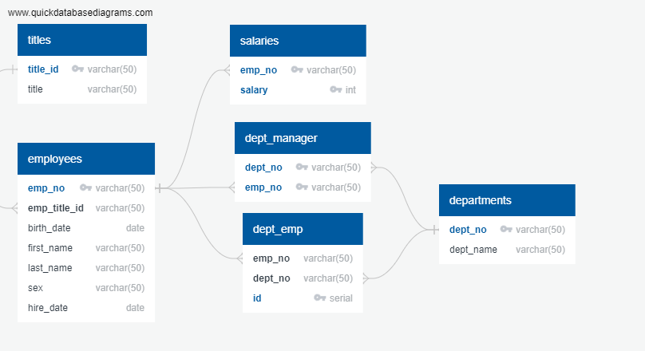

# sql-challenge
# METHOD
Created incorrect version and had trouble running the export in PostgreSQL

After discussion with Deborah Aina (Learning Assistant), reorganized QuickDBD tables.
1. Identify Parent (primary) keys
2. Identify Child (foreign) keys
3. Order tables from highest to least primary keys.
Corrected tables in QuickDBD
Followed directions and used QuickDBD to format database tables. 

Exported to SQL and table created.
Deleted (Cascade) each table to practice writing out the query for tables manually. 
Created tables in sequence and wrote Foreign Keys code from SQL activity 3.03 - Intro to Foreign Keys.
Watched YouTube video by Caleb Curry, SQL Server 28 - Composite Primary Keys to obtain code for Composite Primary Keys.
Saved result as "writtencode" to same folder as QuickDBD- export in EmployeeSQL folder.
Each query was saved in EmployeeSQL named similar to resulting table.
1. 
2. 
3. 
4. 
5. 
6. 
7. 
8. 

# References
Data generated by Mockaroo, LLCLinks to an external site., (2022). Realistic Data Generator.

Composite Primary Keys: SQL Server 28-Composie Primary Keys on YouTube, video by Caleb Curry, https://www.youtube.com/watch?v=YmGi6NdUet8.